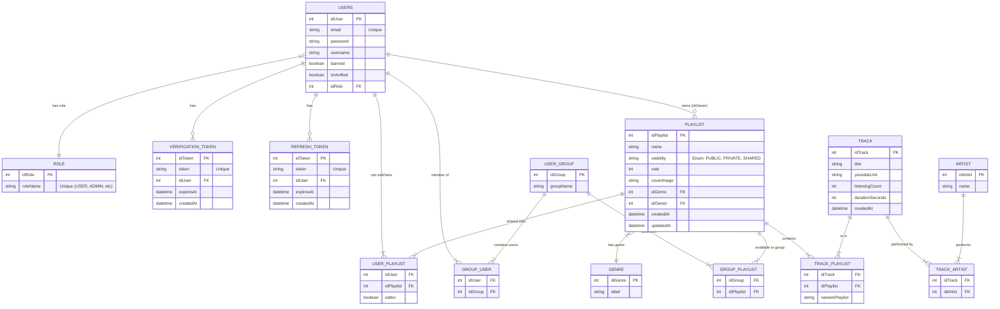

```mermaid

erDiagram
    %% --- AUTHENTICATION ---
    USERS {
        int idUser PK
        string email "Unique"
        string password
        string username
        boolean banned
        boolean isVerified
        int idRole FK
    }

    ROLE {
        int idRole PK
        string roleName "Unique (USER, ADMIN, etc)"
    }

    VERIFICATION_TOKEN {
        int idToken PK
        string token "Unique"
        int idUser FK
        datetime expiresAt
        datetime createdAt
    }

    REFRESH_TOKEN {
        int idToken PK
        string token "Unique"
        int idUser FK
        datetime expiresAt
        datetime createdAt
    }

    %% --- MUSIC CONTENT ---
    PLAYLIST {
        int idPlaylist PK
        string name
        string visibility "Enum: PUBLIC, PRIVATE, SHARED"
        int vote
        string coverImage
        int idGenre FK
        int idOwner FK
        datetime createdAt
        datetime updatedAt
    }

    TRACK {
        int idTrack PK
        string title
        string youtubeLink
        int listeningCount
        int durationSeconds
        datetime createdAt
    }

    ARTIST {
        int idArtist PK
        string name
    }

    GENRE {
        int idGenre PK
        string label
    }

    %% --- SOCIAL & GROUPS ---
    USER_GROUP {
        int idGroup PK
        string groupName
    }

    %% --- PIVOT TABLES (MANY-TO-MANY) ---
    TRACK_ARTIST {
        int idTrack FK
        int idArtist FK
    }

    TRACK_PLAYLIST {
        int idTrack FK
        int idPlaylist FK
        string nameInPlaylist
    }

    USER_PLAYLIST {
        int idUser FK
        int idPlaylist FK
        boolean editor
    }

    GROUP_USER {
        int idUser FK
        int idGroup FK
    }

    GROUP_PLAYLIST {
        int idGroup FK
        int idPlaylist FK
    }

    %% --- RELATIONSHIPS ---
    USERS }|--|| ROLE : "has role"
    USERS ||--o{ VERIFICATION_TOKEN : "has"
    USERS ||--o{ REFRESH_TOKEN : "has"

    USERS ||--o{ PLAYLIST : "owns (idOwner)"
    PLAYLIST }|--|| GENRE : "has genre"

    PLAYLIST ||--|{ TRACK_PLAYLIST : "contains"
    TRACK ||--|{ TRACK_PLAYLIST : "is in"

    TRACK ||--|{ TRACK_ARTIST : "performed by"
    ARTIST ||--|{ TRACK_ARTIST : "performs"

    USERS ||--|{ USER_PLAYLIST : "can edit/view"
    PLAYLIST ||--|{ USER_PLAYLIST : "shared with"

    USERS ||--|{ GROUP_USER : "member of"
    USER_GROUP ||--|{ GROUP_USER : "contains users"

    USER_GROUP ||--|{ GROUP_PLAYLIST : "accesses"
    PLAYLIST ||--|{ GROUP_PLAYLIST : "available to group"

```
