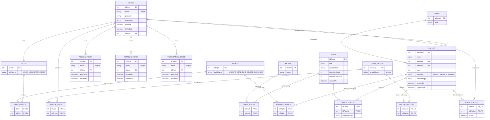

```mermaid

erDiagram
    %% --- AUTHENTICATION & USERS ---
    USERS {
        int idUser PK
        string email "Unique"
        string password
        string username
        boolean banned
        boolean isVerified
        int idRole FK
    }

    ROLE {
        int idRole PK
        string roleName "USER, MODERATOR, ADMIN"
    }

    RIGHTS {
        int idRight PK
        string rightName "CREATE, READ, EDIT, DELETE, BAN_USER"
    }

    ROLE_RIGHTS {
        int idRole PK, FK
        int idRight PK, FK
    }

    %% --- TOKENS ---
    ACCESS_TOKEN {
        int idToken PK
        string token "Unique"
        int idUser FK
        datetime expiresAt
        datetime createdAt
    }

    REFRESH_TOKEN {
        int idToken PK
        string token "Unique"
        int idUser FK
        datetime expiresAt
        datetime createdAt
    }

    VERIFICATION_TOKEN {
        int idToken PK
        string token "Unique"
        int idUser FK
        datetime expiresAt
        datetime createdAt
    }

    %% --- GROUPS ---
    USER_GROUP {
        int idGroup PK
        string groupName "Unique"
    }

    GROUP_USER {
        int idUser PK, FK
        int idGroup PK, FK
    }

    %% --- MUSIC CORE ---
    GENRE {
        int idGenre PK
        string label
    }

    ARTIST {
        int idArtist PK
        string name
    }

    TRACK {
        int idTrack PK
        string title
        string youtubeLink
        int listeningCount
        int durationSeconds
        datetime createdAt
    }

    PLAYLIST {
        int idPlaylist PK
        string name
        int idGenre FK
        int idOwner FK
        int vote
        string visibility "PUBLIC, PRIVATE, SHARED"
        string coverImage
        datetime createdAt
        datetime updatedAt
    }

    %% --- RELATIONS & PIVOTS ---
    TRACK_ARTIST {
        int idTrack PK, FK
        int idArtist PK, FK
    }

    TRACK_PLAYLIST {
        int idTrack PK, FK
        int idPlaylist PK, FK
        string nameInPlaylist
    }

    USER_PLAYLIST {
        int idUser PK, FK
        int idPlaylist PK, FK
        boolean editor
    }

    GROUP_PLAYLIST {
        int idGroup PK, FK
        int idPlaylist PK, FK
    }

    PLAYLIST_RIGHTS {
        int idPlaylist PK, FK
        int idRight PK, FK
    }

    %% --- LINKS ---
    USERS }|--|| ROLE : "has"
    ROLE ||--|{ ROLE_RIGHTS : "defines"
    RIGHTS ||--|{ ROLE_RIGHTS : "included in"

    USERS ||--o{ ACCESS_TOKEN : "owns"
    USERS ||--o{ REFRESH_TOKEN : "owns"
    USERS ||--o{ VERIFICATION_TOKEN : "owns"

    USERS }|--|{ GROUP_USER : "member of"
    USER_GROUP ||--|{ GROUP_USER : "contains"

    USERS ||--o{ PLAYLIST : "creates (Owner)"
    GENRE ||--o{ PLAYLIST : "categorizes"

    PLAYLIST ||--|{ TRACK_PLAYLIST : "contains"
    TRACK ||--|{ TRACK_PLAYLIST : "is in"

    TRACK ||--|{ TRACK_ARTIST : "performed by"
    ARTIST ||--|{ TRACK_ARTIST : "performs"

    USERS ||--|{ USER_PLAYLIST : "access/edit"
    PLAYLIST ||--|{ USER_PLAYLIST : "shared with user"

    USER_GROUP ||--|{ GROUP_PLAYLIST : "access"
    PLAYLIST ||--|{ GROUP_PLAYLIST : "shared with group"

    PLAYLIST ||--|{ PLAYLIST_RIGHTS : "has specific rights"
    RIGHTS ||--|{ PLAYLIST_RIGHTS : "applied to"

```
