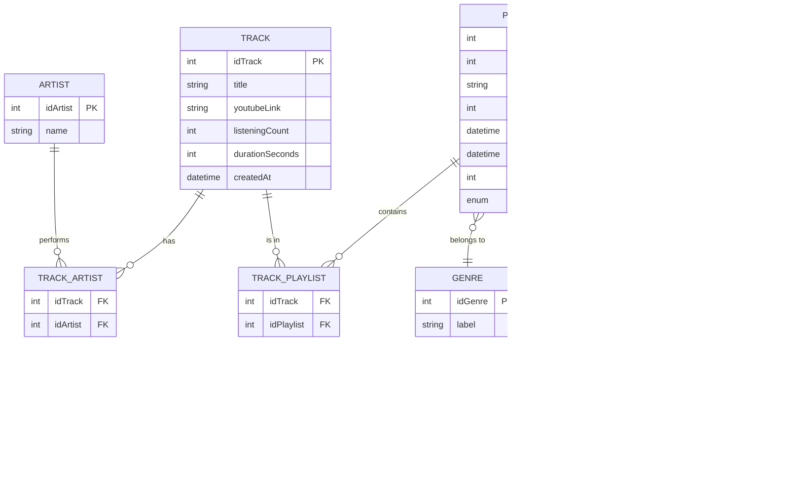

```mermaid
erDiagram
    %% Relations
    TRACK ||--o{ TRACK_ARTIST : "has"
    ARTIST ||--o{ TRACK_ARTIST : "performs"
    PLAYLIST ||--o{ TRACK_PLAYLIST : "contains"
    TRACK ||--o{ TRACK_PLAYLIST : "is in"
    PLAYLIST }o--|| GENRE : "belongs to"
    USER ||--o{ USER_PLAYLIST : "participate"
    PLAYLIST ||--o{ USER_PLAYLIST : "contains"
    PLAYLIST }o--|| USER : "create"
    TRACK {
        int idTrack PK
        string title
        string youtubeLink
        int listeningCount
        int durationSeconds
        datetime createdAt
    }
    ARTIST {
        int idArtist PK
        string name
    }
    TRACK_ARTIST {
        int idTrack FK
        int idArtist FK
    }
    PLAYLIST {
        int idPlaylist PK
        int idOwner FK
        string name
        int idGenre FK
        datetime createdAt
        datetime updatedAt
        int vote
        enum visibility
    }
    GENRE {
        int idGenre PK
        string label
    }
    TRACK_PLAYLIST {
        int idTrack FK
        int idPlaylist FK
    }
    USERS {
        int idUser PK
        string email
        string password
        string username
        enum role
        boolean banned
    }
    USER_PLAYLIST {
        int idUser FK
        int idPlaylist FK
        boolean editor
    }
```