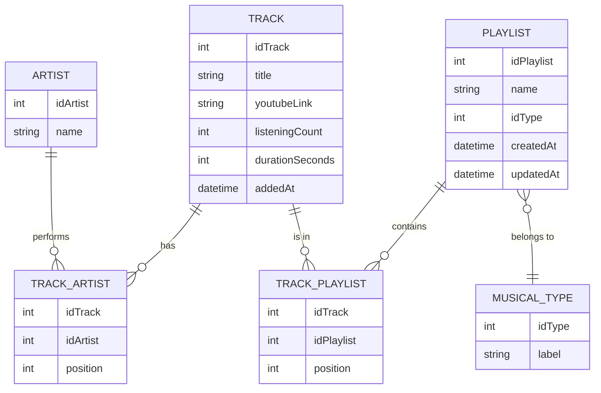

```mermaid
erDiagram
    %% Relations
    TRACK ||--o{ TRACK_ARTIST : "has"
    ARTIST ||--o{ TRACK_ARTIST : "performs"
    PLAYLIST ||--o{ TRACK_PLAYLIST : "contains"
    TRACK ||--o{ TRACK_PLAYLIST : "is in"
    PLAYLIST }o--|| MUSICAL_TYPE : "belongs to"
    TRACK {
        int idTrack
        string title
        string youtubeLink
        int listeningCount
        int durationSeconds
        datetime addedAt
    }
    ARTIST {
        int idArtist
        string name
    }
    TRACK_ARTIST {
        int idTrack
        int idArtist
        int position
    }
    PLAYLIST {
        int idPlaylist
        string name
        int idType
        datetime createdAt
        datetime updatedAt
    }
    MUSICAL_TYPE {
        int idType
        string label
    }
    TRACK_PLAYLIST {
        int idTrack
        int idPlaylist
        int position
    }
```